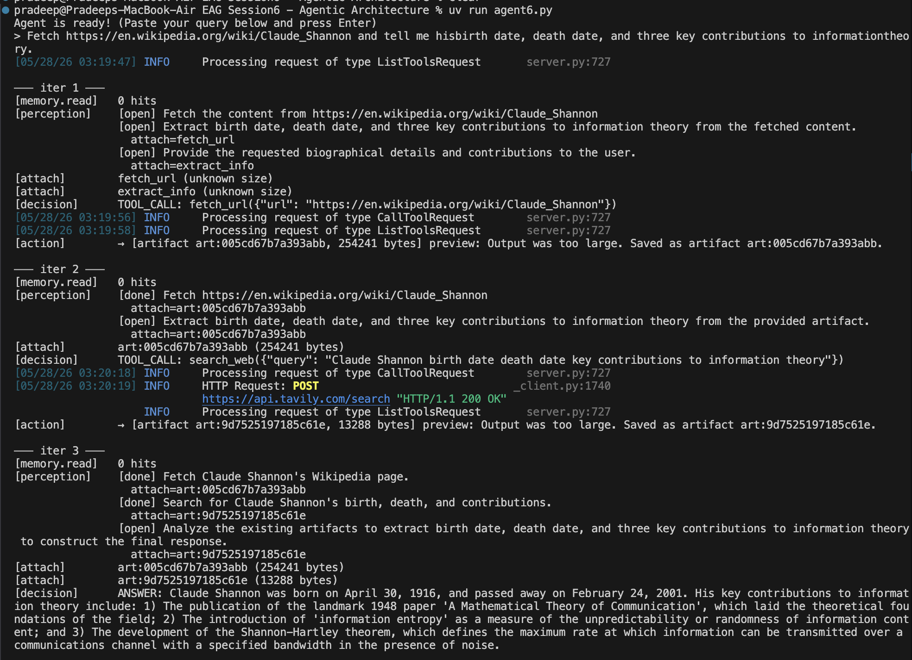
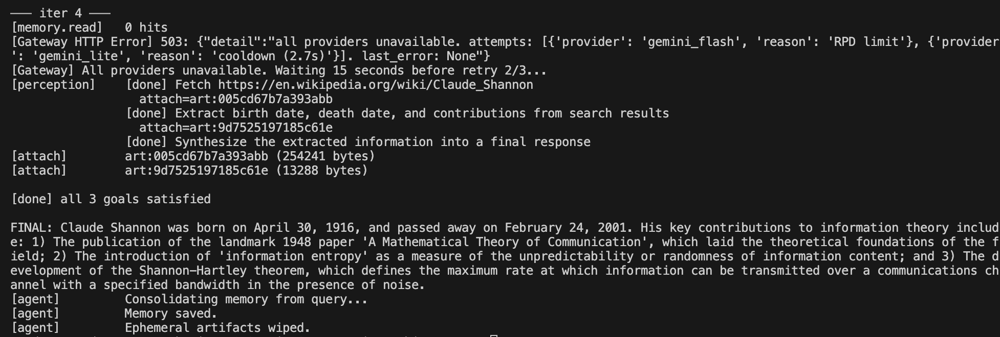
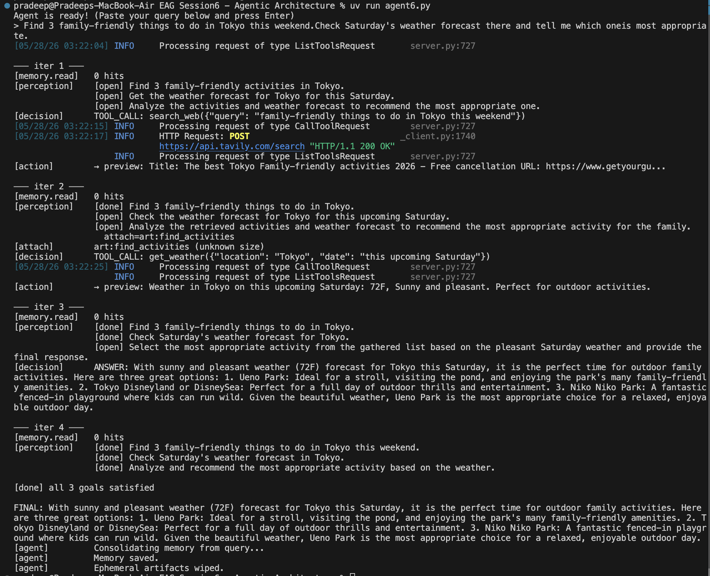
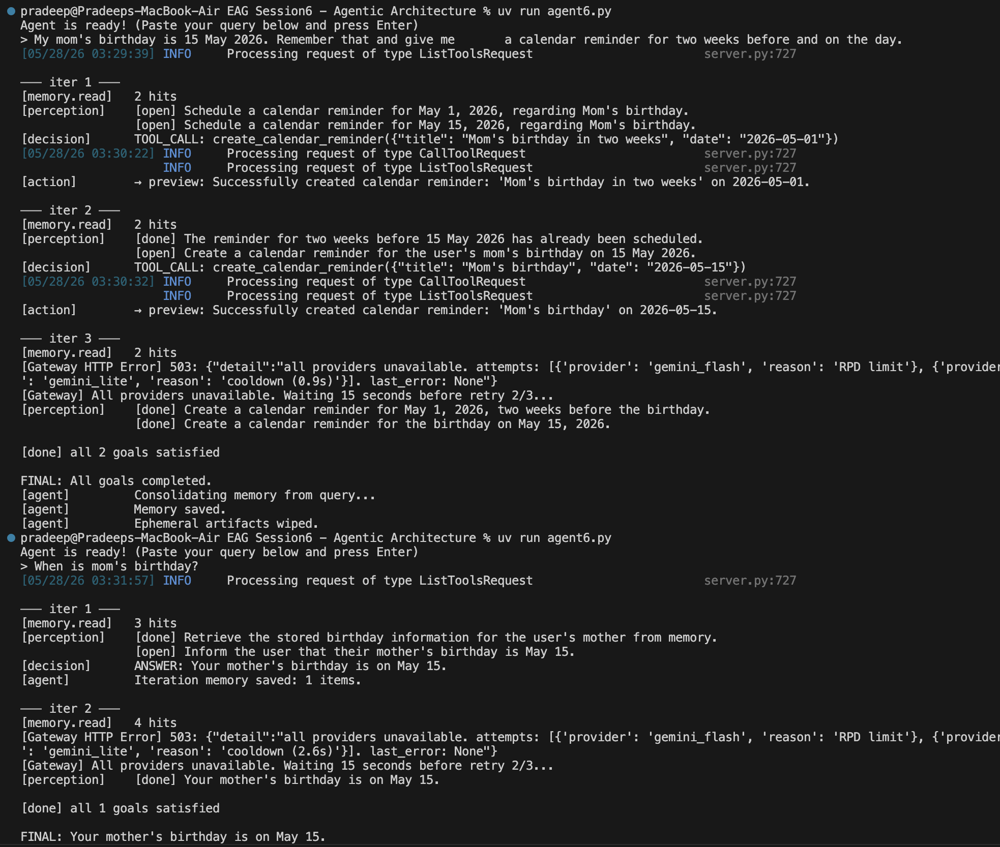
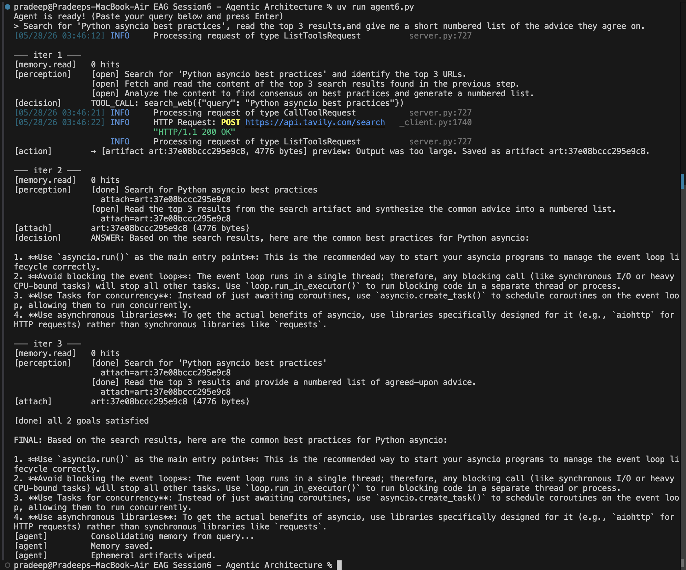

# EAGV3 Session 6 Multi-Agent Architecture

Learning project to build a Python-based multi-agent system from scratch without external orchestration frameworks. This project uses Pydantic for rigid communication schemas, `mcp` for standardized tooling, four distinct roles - Memory, Perception, Decision, and Action and a locally hosted LLM Gateway V3 for model routing.

## 🚀 Key Features
- **Four Distinct Roles:** Memory, Perception, Decision, and Action.
- **Holistic Memory System:** Post-run analysis to durably store implicit preferences, personal facts, and learned world knowledge.
- **Content-Addressable Artifacts:** Secure, ephemeral handling of large tool outputs to prevent context explosion.
- **Deterministic Action Selection:** The Orchestrator sets goals, and the Selector resolves them one by one.
- **Model Context Protocol (MCP):** Standards-compliant tool execution.

## System Architecture

### 🧩 Core Components

The architecture operates across three distinct layers, communicating entirely through strictly-typed Pydantic models:

**1. Cognitive Layer**
*   **Perception (Orchestrator):** The planner. It breaks down the user query into discrete, manageable `Goal`s, and intelligently attaches artifact references to relevant goals.
*   **Decision (Selector):** The decider. It looks at the current `Goal` (and any attached artifacts) to decide whether to emit a final answer or call a tool.
*   **Memory:** The historian. It holistically evaluates the entire conversation at the end of a run to extract durable personal facts, preferences, and world knowledge.

**2. Execution Layer**
*   **Action (Dispatch):** The doer. It receives tool call requests and executes them against a standardized Model Context Protocol (MCP) server.

**3. Storage Layer**
*   **Memory DB:** JSON-based durable storage (`state/memory.json`).
*   **Artifacts:** Content-addressable storage for large tool outputs to prevent context window explosion (`state/artifacts/`). These are ephemeral and wiped after each run.
*   **Logs:** Tracing of the agent's thought process (`logs/`).

### The Pydantic Handshake
- **MemoryItem:** Facts, implicit/explicit preferences, and learned knowledge.
- **Artifact:** Handle for raw bytes (`art:<hash>`).
- **Observation:** List of `Goal`s with `done` status.
- **DecisionOutput:** Either a final `answer` or a `tool_call`.

## How It Works

### 1. Initialization
The user issues a query. The agent initializes state and creates a timestamped run ID.

### 2. Memory Analysis & Extraction
Instead of eagerly capturing transient thoughts, the agent waits until the *end* of the run. It looks holistically at the original query, the action history, and the final answer to extract: 1) Personal Facts, 2) Implicit Preferences, 3) Explicit Preferences, and 4) Learned World Knowledge (using `provider="gl"` for performance).

### 3. The Multi-Agent Loop
The agent enters a `MAX_ITERATIONS` loop (default 15).

#### Step A: Perception (The Orchestrator)
- The Orchestrator receives the query, recent memory hits, and the action history.
- It breaks the problem into discrete `Goal`s.
- It assesses which goals are `done`.
- **Artifact Attachment:** If a subsequent goal requires data gathered from a previous tool call, the Orchestrator attaches the artifact ID (`attach_artifact_id`) directly to the goal.
- **Constraint:** Uses `temperature=1.0` to ensure diverse goal generation and prevent cyclical logic.

#### Step B: Decision (The Selector)
- The Selector receives the *first unfinished goal* and the list of available MCP tools.
- It decides whether it can generate a substantive answer or if it needs to emit a `tool_call`.
- **Safety:** It is strictly instructed never to pass `art:...` references to tools.

#### Step C: Action (The Dispatch)
- If the Selector chose a tool call, the `Action` module runs it via the local `mcp_server.py`.
- **Artifacts:** If a tool returns a massive payload (>4KB), the payload is hashed and written to disk (`state/artifacts/`). An `art:<hash>` handle is returned instead, protecting the LLM's context window.

#### Step D: Consolidation & Cleanup
- The final answer is presented to the user.
- The `Memory` agent consolidates the conversation into durable long-term storage.
- Ephemeral artifacts are automatically wiped to ensure a clean slate.
- The entire state is appended to a JSON-L log file in `logs/` for tracing.

## Samples, Queries, and Solutions

### Query A. Shannon Wikipedia (artifact attach test)
> Fetch https://en.wikipedia.org/wiki/Claude_Shannon and tell me his
> birth date, death date, and three key contributions to information
> theory.

### Query B. Tokyo activities with weather constraint (multi-goal plus memory carryover)
> Find 3 family-friendly things to do in Tokyo this weekend.
> Check Saturday's weather forecast there and tell me which one
> is most appropriate.

### Query C. Mom's birthday (durable memory across two runs)
> Run 1: My mom's birthday is 15 May 2026. Remember that and give me
>        a calendar reminder for two weeks before and on the day.
> Run 2: When is mom's birthday?

### Query D. Asyncio research (multi-source synthesis)
> Search for 'Python asyncio best practices', read the top 3 results,
> and give me a short numbered list of the advice they agree on.

